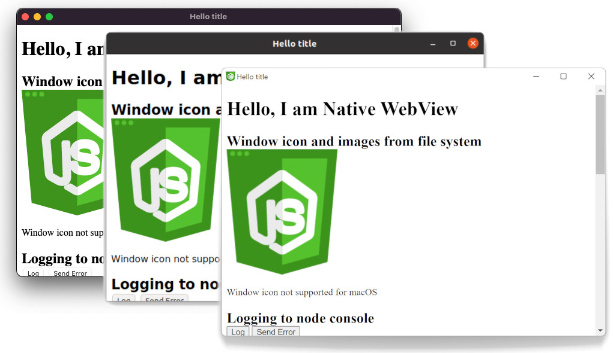

# native-webview


Library for creating native app for all platforms with JavaScript, HTML and CSS environment.
This package is nodejs wrap of the [wry](https://github.com/tauri-apps/wry) library.

## Compiled for

- Windows `x86_64` (works with arm)
- MacOS `x86_64` and `arm_64` (m1)
- Linux `x86_64` and `arm_64`



## Features

- `focus` - focus the window and webview
- `close` - close the window
- `eval` - eval javascript in webview
- `title` - title of window
- `transparent` - window with transparent background
- `windowIcon` - icon of window (only Window and Linux)
- `resizable` - allow user to resize
- `innerSize` - set size
- `minInnerSize` - set minimum size
- `maxInnerSize` - set maximum size
- `outerPosition` - set position of window
- `alwaysOnTop` - window always on top
- `decorations` - turn on/off decorations (window border)
- `fullscreen` - set fullscreen
- `maximized` - maximize the window
- `minimized` - minimize the window
- `files` - handle files from file system

## Usage

```js
import { resolve } from "path";
import OpenWebView from "native-webview";

const wv = await OpenWebView({
    title: "Hello title",
    innerSize: { width: 640, height: 420 },
    getPath: src => resolve(__dirname, src),
    onMessage: message => console.log("Message from WebView:", message)
});
```

## Examples

```bash
$ npm run example -- examples/features.ts
$ npm run example -- examples/transparent.ts
```

## System specific

### Windows

Just double click 😉.

### MacOS

Dynamic change window icon is not supported. You can easily use icon with creation *.app file.

### Linux

Native WebView uses WebKitGTK for WebView. So please make sure following packages are installed for development:

#### Arch Linux / Manjaro:

```bash
sudo pacman -S webkit2gtk libappindicator-gtk3
```

#### Debian / Ubuntu:

```bash
sudo apt install libwebkit2gtk-4.0-dev libappindicator3-dev
```

#### Fedora

```bash
sudo dnf install gtk3-devel webkit2gtk3-devel libappindicator-gtk3-devel
```